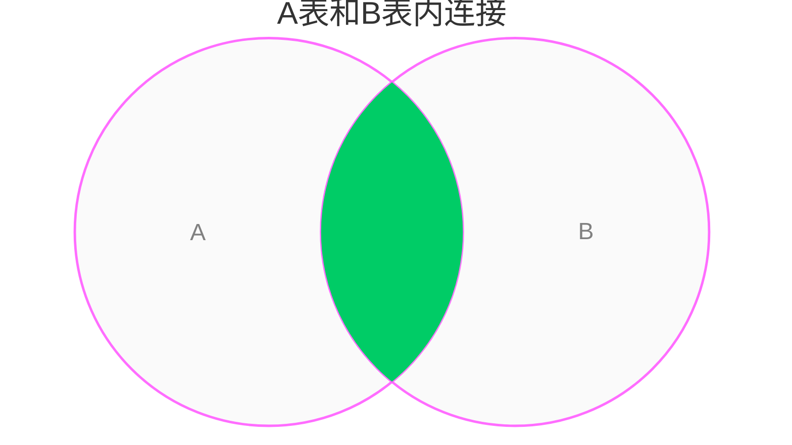
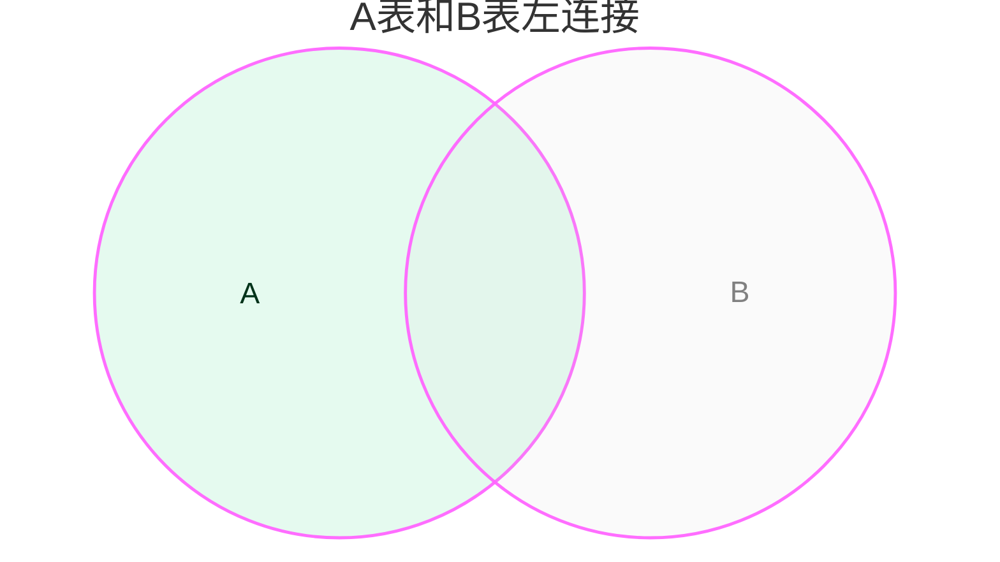
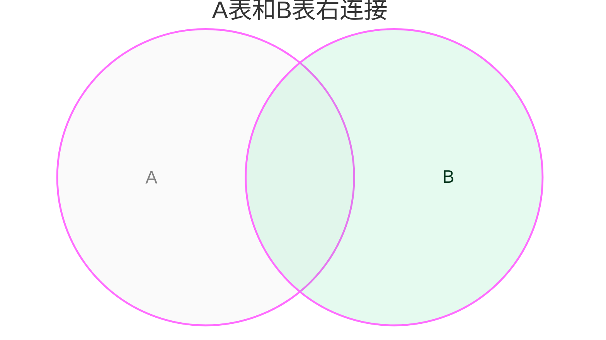
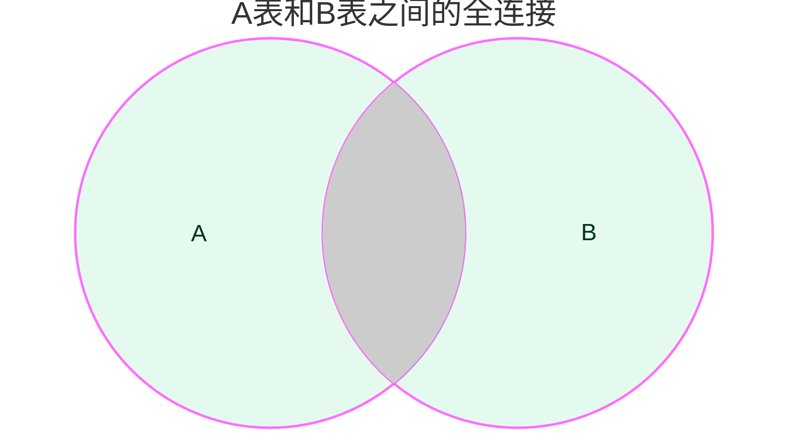

# 概述

在 PostgreSQL 中，JOIN 语句用于将数据库中的两个表或者多个表连接起来。

比如在一个学校系统中，有一个学生信息表和一个学生成绩表。这两个表通过学生 ID 字段关联起来。当我们要查询学生的成绩的时候，就需要连接两个表以查询学生信息和成绩。

# 连接类型

PostgreSQL 支持以下类型的连接：

- 交叉连接 (CROSS JOIN)
- 内联接 (INNER JOIN)
- 自然连接 (NATURAL JOIN)
- 左连接/左外连接 (LEFT [OUTER] JOIN)
- 右连接/右外连接 (RIGHT [OUTER] JOIN)
- 全连接/全外连接 (RIGHT [OUTER] JOIN)

# 创建实例表和数据

关于表连接的实例都使用 student 和 student_score 两个表来完成。

首先，使用下面的 SQL 语句创建表 student 和 student_score ：

```sql
CREATE TABLE student (
  student_id INTEGER NOT NULL,
  name varchar(45) NOT NULL,
  PRIMARY KEY (student_id)
);

CREATE TABLE student_score (
  student_id INTEGER NOT NULL,
  subject varchar(45) NOT NULL,
  score INTEGER NOT NULL
);
```

然后，分别在两个表中插入数据：

```sql
INSERT INTO
  student (student_id, name)
VALUES
  (1,'Tim'),(2,'Jim'),(3,'Lucy');

INSERT INTO
  student_score (student_id, subject, score)
VALUES
  (1,'English',90),
  (1,'Math',80),
  (2,'English',85),
  (5,'English',92);
```

以下语句使用 SELECT 检查表中的数据：


查询学生信息表中的数据：

```sql
SELECT * FROM student;
```

执行结果如下：

```text
 student_id | name
------------+------
          1 | Tim
          2 | Jim
          3 | Lucy
(3 rows)
```

查询学生成绩表中的数据：

```sql
SELECT * FROM student_score;
```

执行结果如下：

```text
 student_id | subject | score
------------+---------+-------
          1 | English |    90
          1 | Math    |    80
          2 | English |    85
          5 | English |    92
(4 rows)
```

注意，为了演示，我们特意使用了特殊的数据行：

- student 表中 student_id 为 3 的学生没有成绩。
- student_score 表中的最后一行的 student_id 为 5，而 student 表中不存在 student_id 为 5 的学生。

# 交叉连接

交叉连接返回两个集合的笛卡尔积。也就是两个表中的所有的行的所有可能的组合。这相当于内连接没有连接条件或者连接条件永远为真。

如果一个有 m 行的表和另一个有 n 行的表，它们交叉连接将返回 m * n 行。

在大多数场景下，交叉连接的结果没有意义，你需要使用 WHERE 子句过滤自己所需的数据行。

显式的交叉连接 student 和 student_score 表：

```sql
SELECT
  student.*,
  student_score.*
FROM
  student CROSS JOIN student_score;
```

隐式的交叉连接 student 和 student_score 表：

```sql
SELECT
  student.*,
  student_score.*
FROM
  student, student_score;
```

这两种方式的输出一样。

```text
 student_id | name | student_id | subject | score
------------+------+------------+---------+-------
          1 | Tim  |          1 | English |    90
          1 | Tim  |          1 | Math    |    80
          1 | Tim  |          2 | English |    85
          1 | Tim  |          5 | English |    92
          2 | Jim  |          1 | English |    90
          2 | Jim  |          1 | Math    |    80
          2 | Jim  |          2 | English |    85
          2 | Jim  |          5 | English |    92
          3 | Lucy |          1 | English |    90
          3 | Lucy |          1 | Math    |    80
          3 | Lucy |          2 | English |    85
          3 | Lucy |          5 | English |    92
(12 rows)
```

# 内连接

内连接基于连接条件组合两个表中的行。内连接相当于加了过滤条件的交叉连接。

内连接将第一个表的每一行与第二个表的每一行进行比较，如果满足给定的连接条件，则将两个表的行组合在一起作为结果集中的一行。



以下 SQL 语句将 student 表和 student_score 表内连接，以查找有效的学生成绩信息：

```sql
SELECT
  student.*,
  student_score.*
FROM
  student
  INNER JOIN student_score
  ON student.student_id = student_score.student_id;
```

等价于：

```sql
SELECT
  student.*,
  student_score.*
FROM
  student, student_score
WHERE
  student.student_id = student_score.student_id;
```

输出一样结果：

```text
 student_id | name | student_id | subject | score
------------+------+------------+---------+-------
          1 | Tim  |          1 | English |    90
          1 | Tim  |          1 | Math    |    80
          2 | Jim  |          2 | English |    85
(3 rows)
```

注意输出结果中，student 表中 student_id 为 3 的行和 student_score 表中 student_id 为 5 的行没有出现在输出结果中，这是因为他们没有满足连接条件：student.student_id = student_score.student_id。

由于两个表都使用相同的字段进行等值比较，因此您可以使用 USING 以下查询中所示的子句：

```sql
SELECT
  student.*,
  student_score.*
FROM
  student
  INNER JOIN student_score USING(student_id);
```

# 自然连接

自然连接同样是基于条件的连接，它是一种特殊的内连接。两个表做自然连接时，两个表中所有同名的列都将做等值比较。这些连接条件都是隐式创建的。

以下 SQL 语句对 student 表和 student_score 做自然连接，等效于上面的内连接语句：

```sql
SELECT
  *
FROM
  student NATURAL JOIN student_score;
```

执行结果如下：

```text
 student_id | name | subject | score
------------+------+---------+-------
          1 | Tim  | English |    90
          1 | Tim  | Math    |    80
          2 | Jim  | English |    85
(3 rows)
```

注意，自然连接不需要使用 ON 创建连接条件，它的连接条件是隐式创建的。 自然连接的结果集中，两个表中同名的列只出现一次。

# 左连接

左连接是左外连接的简称，左连接需要连接条件。

两个表左连接时，第一个表称为左表，第二表称为右表。例如 A LEFT JOIN B，A 是左表，B 是右表。

左连接以左表的数据行为基础，根据连接条件匹配右表的每一行，如果匹配成功则将左表和右表的行组合成新的数据行返回；如果匹配不成功则将左表的行和 NULL 值组合成新的数据行返回。



以下 SQL 语句将 student 表和 student_score 表左连接：

```sql
SELECT
  student.*,
  student_score.*
FROM
  student
  LEFT JOIN student_score
  ON student.student_id = student_score.student_id;
```

执行结果如下：

```text
 student_id | name | student_id | subject | score
------------+------+------------+---------+--------
          1 | Tim  |          1 | English |     90
          1 | Tim  |          1 | Math    |     80
          2 | Jim  |          2 | English |     85
          3 | Lucy |     <null> | <null>  | <null>
(4 rows)
```

1. 结果集中包含了 student 表的所有记录行。
2. student_score 表中不包含 student_id = 3 的记录行，因此结果集中最后一行中来自 student_score 的列的内容为 NULL。
3. student_score 表存在多个 student_id 为 1 的行，因此结果集中也产生了多个来自 student 表对应的行。

由于两个表都使用相同的字段进行等值比较，因此您可以使用 USING 以下查询中所示的子句：

```sql
SELECT
  student.*,
  student_score.*
FROM
  student
  LEFT JOIN student_score USING(student_id);
```

# 右连接

右连接是右外连接的简称，右连接需要连接条件。

右连接与左连接处理逻辑相反，右连接以右表的数据行为基础，根据条件匹配左表中的数据。如果匹配不到左表中的数据，则左表中的列为 NULL 值。



以下 SQL 语句将 student 表和 student_score 表右连接：

```sql
SELECT
  student.*,
  student_score.*
FROM
  student
  RIGHT JOIN student_score
  ON student.student_id = student_score.student_id;
```

执行结果如下：

```text
 student_id |  name  | student_id | subject | score
------------+--------+------------+---------+-------
          1 | Tim    |          1 | English |    90
          1 | Tim    |          1 | Math    |    80
          2 | Jim    |          2 | English |    85
     <null> | <null> |          5 | English |    92
(4 rows)
```

从结果集可以看出，由于左表中不存在到与右表 student_id = 5 匹配的记录，因此最后一行左表的列的值为 NULL。

右连接其实是左右表交换位置的左连接，即 A RIGHT JOIN B 就是 B LEFT JOIN A，因此右连接很少使用。

上面例子中的右连接可以转换为下面的左连接：

```sql
SELECT
  student.*,
  student_score.*
FROM
  student_score
  LEFT JOIN student
  ON student.student_id = student_score.student_id;
```

# 全连接

全连接是全外连接的简称，它是左连接和右连接的并集。全连接需要连接条件。



以下 SQL 语句将 student 表和 student_score 表全连接：

```sql
SELECT
  student.*,
  student_score.*
FROM
  student
  FULL JOIN student_score
  ON student.student_id = student_score.student_id;
```


```text
 student_id |  name  | student_id | subject | score
------------+--------+------------+---------+--------
          1 | Tim    |          1 | English |     90
          1 | Tim    |          1 | Math    |     80
          2 | Jim    |          2 | English |     85
     <null> | <null> |          5 | English |     92
          3 | Lucy   |     <null> | <null>  | <null>
(5 rows)
```

由于两个表都使用相同的字段进行等值比较，因此您可以使用 USING 以下查询中所示的子句：

```sql
SELECT
  student.*,
  student_score.*
FROM
  student
  FULL JOIN student_score USING(student_id);
```

全连接是左连接和右连接的并集。 上面的全连接可以使用 LEFT JOIN, RIGHT JOIN, 和 UNION 改写：

```sql
SELECT
  student.*,
  student_score.*
FROM
  student
  LEFT JOIN student_score USING(student_id)

UNION

SELECT
  student.*,
  student_score.*
FROM
  student
  RIGHT JOIN student_score  USING(student_id);
```

# 总结

本文介绍了 PostgreSQL 中的连接语句，包括交叉连接、内连接、左连接、右连接、全连接、自然连接。