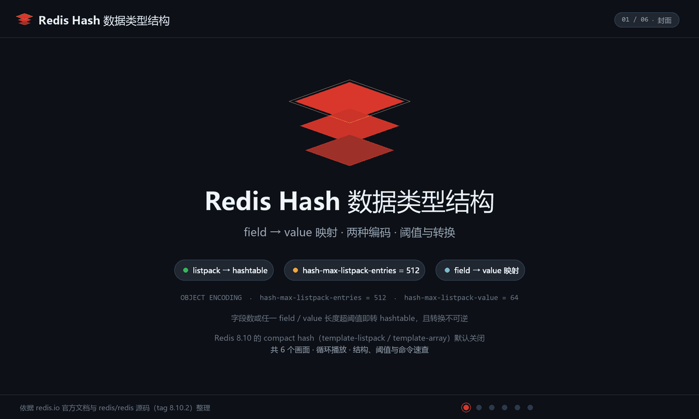
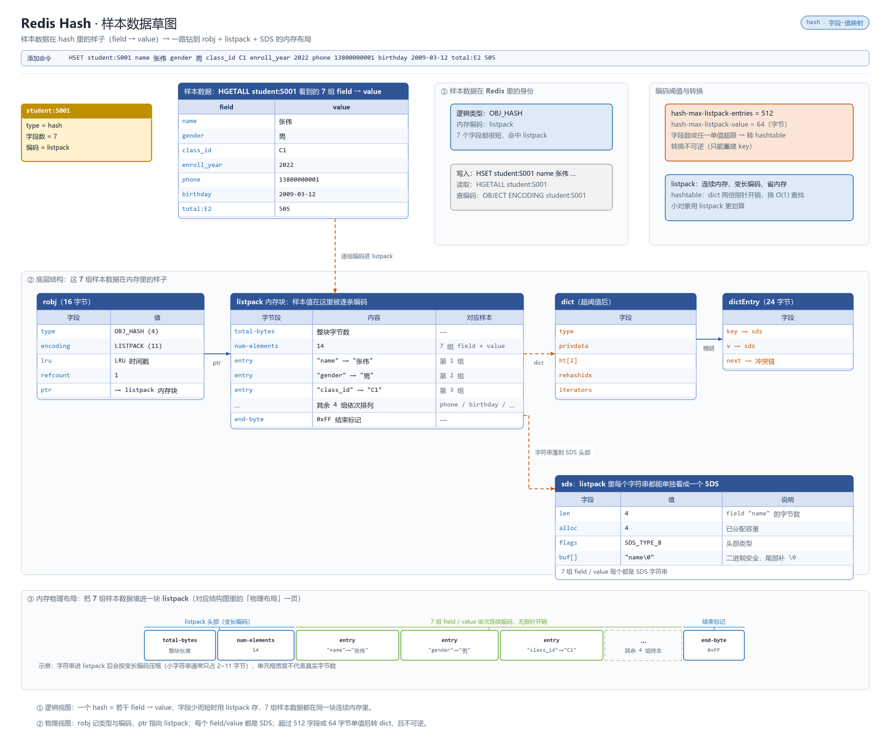

# 概述

Hash 在单个键内存储字段-值对的记录类型，类似 Java HashMap 或 Python 字典。

- 归属与可用性：Redis 开源核心类型（1.0+）
- 官方文档：<https://redis.io/docs/latest/develop/data-types/hashes/>

小容量时用 **listpack**（7.0 起取代 ziplist）紧凑存储，超过阈值转 **hashtable**，由 `hash-max-listpack-entries`（默认 128）与 `hash-max-listpack-value`（默认 64）控制。**7.4 起支持字段级 TTL**（`HEXPIRE`/`HTTL`/`HPERSIST` 等），**8.0 起补充 `HSETEX`/`HGETEX`/`HGETDEL`**，**8.8 起支持字段级键空间通知**，**8.10 起新增紧凑 Hash 编码（同 schema 键共享字段名）与 `HIMPORT` 批量导入**——Hash 已能替代 String 建模带独立过期时间的多字段对象。

# 数据存储结构

字段少且短时用 `listpack` 连续内存紧凑存，超过 `hash-max-listpack-entries`/`-value` 转 `hashtable`（dict）；8.10 起同构小 hash 还可用紧凑编码共享字段名。

**动画：结构与写入演化**



**草图：样本数据在内存里的真实布局**



> 上面是 Hash 自己的布局；所有 value 都挂在 `redisObject`（robj）上，`type` 定逻辑类型、`encoding` 定内存布局并随规模自动切换。robj 结构、各类型编码全景与 `OBJECT ENCODING` 调试方式，统一见 [030.value 底层原理](../09.原理与源码/030.value底层原理.md#编码全景)。

# 命令速查

| 命令 | 说明 | 复杂度 |
|------|------|--------|
| `HSET key f v [f v ...]` | 写字段（存在即覆盖） | O(N) |
| `HGET key f` / `HMGET key f...` | 读字段 | O(1) / O(N) |
| `HGETALL key` | 取全部字段 | O(N) |
| `HDEL key f...` / `HEXISTS` / `HLEN` | 删字段 / 判断存在 / 字段数 | O(N) / O(1) / O(1) |
| `HKEYS` / `HVALS` | 全部字段名 / 字段值 | O(N) |
| `HINCRBY` / `HINCRBYFLOAT` | 字段原子增减 | O(1) |
| `HSETNX key f v` | 字段不存在才写 | O(1) |
| `HSETEX key [FNX \| FXX] [EX/PX/EXAT/PXAT/KEEPTTL] FIELDS n f v ...` | 写字段 + 可选字段级过期一体（8.0+） | O(N) |
| `HRANDFIELD key [count [WITHVALUES]]` | 随机字段（6.2+） | O(N log N) |
| `HSCAN key cursor [MATCH p] [COUNT n]` | 增量遍历，不阻塞 | O(1)/次 |
| `HEXPIRE key s FIELDS n f...` / `HTTL` / `HPERSIST` | 字段级 TTL（7.4+） | O(N) |
| `HGETEX` / `HGETDEL` | 读并刷新字段过期 / 读并删字段（8.0+） | O(N) |
| `HIMPORT SET key fieldset-name value ...` | 紧凑 hash 的会话式批量导入（配合 `HIMPORT FIELDSET` 先传 schema，8.10+） | O(N) |

# 典型场景

1. **对象缓存 + 局部读写**：`HSET user:1000 name tom age 20`，改年龄只动一个字段，无需序列化整个对象。
2. **购物车**：`HSET cart:{uid} sku:88 2`，加购/改数量/结算清空都是单键操作，配合 `HINCRBY` 合并同款数量。
3. **多端会话字段过期**（7.4+）：同一 user 键下不同设备 token 各自 `HEXPIRE`，替代"一设备一键"的碎片化设计。
4. **原子改值**：库存 `HINCRBY stock:goods:88 -1`，返回值即最新库存，负数则回补并拒绝。
5. **配置中心**：`HMGET app:config timeout retry pool` 一次取多字段。
6. **字段变更监听**（8.8+）：Hash 子键级键空间通知让“某字段变了就收到”不必再靠全量 `HGETALL` 轮询；同 schema 大最海量小 hash（如每个用户一条记录）升级到 8.10+ 可用紧凑编码 + `HIMPORT` 批量导入降内存。

# 操作示例

## 学生档案与局部更新

```bash
redis-cli HSET "student:S001" name 张伟 gender 男 class_id C1 enroll_year 2022 phone 13800000001 birthday 2009-03-12 total:E2 505
redis-cli HGET "student:S001" name                                  # "张伟"
redis-cli HINCRBY "student:S001" total:E2 5                          # 补录 5 分，只动一个字段
redis-cli HGETALL "student:S001"                                    # 7 个 field-value，小 hash 才适合全量读
redis-cli HMGET "exam:E2:subject_avg" SUB1 SUB2 SUB3               # 语文/数学/英语平均分一次取回
```

## 多端登录会话：字段级 TTL（7.4+/8.0+）

```bash
# S001 的家长与本人在网页端/移动端各持一个 token，写入同一键、各自独立过期
redis-cli HSETEX "session:S001" FIELDS 4 web 'T-web-8d1e' app 'T-app-2c7a'
redis-cli HEXPIRE "session:S001" 1800 FIELDS 1 web       # 网页端 30 分钟
redis-cli HEXPIRE "session:S001" 604800 FIELDS 1 app     # 移动端 7 天
redis-cli HTTL "session:S001" FIELDS 2 web app           # 观察两端剩余有效期
redis-cli HGETEX "session:S001" EX 1800 FIELDS 1 web     # 读的同时续期网页端
```

告别“一设备一键”的碎片化设计：同一个学生键内完成字段隔离与差异化过期。

## 一次性字段核销

```bash
# 成绩修改申请的令牌取出并删除原子完成：重放拿不到值
redis-cli HGETDEL "apply:score:S004:SUB2" FIELDS 1 token
```

## 班级总分累加：每生一字段

```bash
# C1 期中总分：键名带考试维度，每学生一个 field，HINCRBY 返回值即最新总分
redis-cli HSET "class:C1:total:E2" S001 505 S002 466 S003 490 S004 374 S005 447
redis-cli HINCRBY "class:C1:total:E2" S004 6   # 阅卷加分：(integer) 380
redis-cli HSTRLEN "student:S001" name            # 中文字段字节数≠字符数，按字节算
```

# 避坑

- **大 Hash 是运维黑洞**：百万字段的 Hash 导致 `HGETALL` 卡线程、Cluster 迁移/备份粒度整键无法拆分、内存缩容滞后——按 `uid % 100` 分桶拆键。参见 [070.大key与热key](../08.工程化/070.大key与热key.md)。
- **遍历用 HSCAN 不要 HKEYS+HGET 循环**：一次全量 O(N) 阻塞，且逐字段读写有 N 次往返（可 pipeline 缓解）。
- **字段全删即键消失**：`HLEN`/`EXISTS` 语义要清楚，别依赖"空 Hash 还在"。
- **编码转换不可逆**：listpack 转 hashtable 后即使删到很小也不会转回（除非重建），压测时按线上真实规模建键。
- 对 Hash 键执行 `GET`、对 String 执行 `HGET` 都会 `WRONGTYPE`。
- `HINCRBY` 溢出仍是 64 位整数边界；浮点累加用 `HINCRBYFLOAT` 但注意二进制精度，金额建议以"分"存整数。

# 总结

- Hash 建模"一个实体的多个属性"：省序列化、支持字段级原子更新，是对象缓存首选；
- 小对象 listpack 极省内存，大对象务必分桶控制单键规模；
- 7.4+/8.0+ 的字段级 TTL 与 `HSETEX`/`HGETEX`/`HGETDEL` 让 Hash 在多端会话、短 TTL 令牌等场景替代大量散落 String 键；8.10+ 的紧凑 hash 进一步把“海量同构小 hash”的内存成本打下来。
