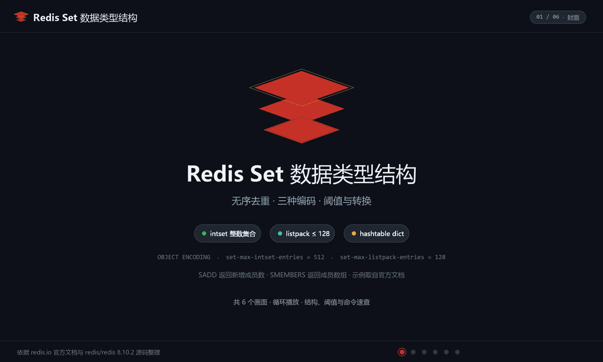
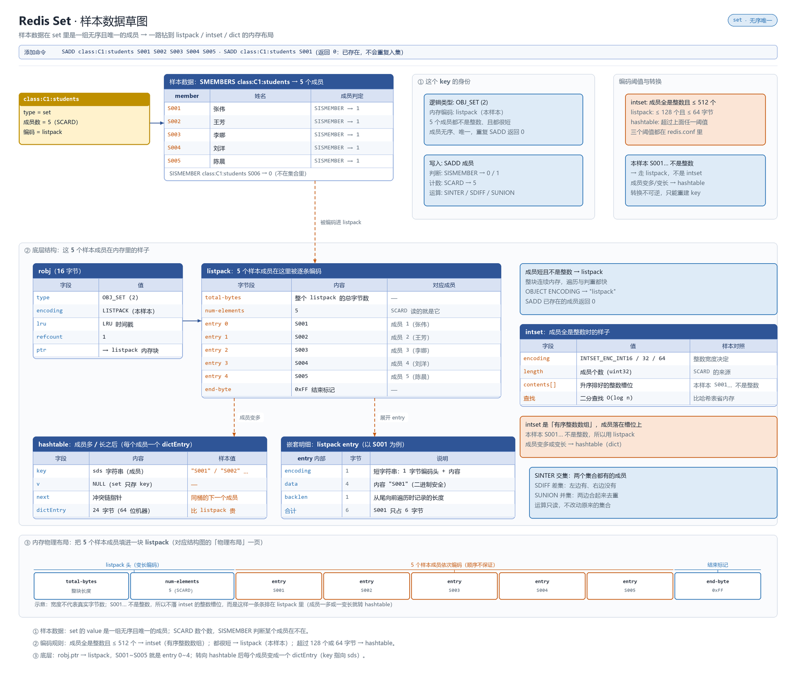

# 概述

Set 是无序的唯一字符串集合，支持交、并、差等集合运算。

- 归属与可用性：Redis 开源核心类型（1.0+）
- 官方文档：<https://redis.io/docs/latest/develop/data-types/sets/>

三种编码自动切换：全整数且量少用 **intset**（有序数组，二分查找）；元素少用 **listpack**（6.2+，`set-max-listpack-entries` 默认 128）；超出后转 **hashtable**（`set-max-intset-entries` 默认 512）。成员唯一性由类型层保证，无需先查后写。**8.10 起新增 `SDIFFCARD`/`SUNIONCARD`**，与 7.0 的 `SINTERCARD` 凑齐“只数不算”的基数三件套（见 [Redis 8.10 版本特性](../10.Redis%20版本特性/090.Redis8.10.md)）。

# 数据存储结构

纯整数且量小用 `intset`（有序整数数组、极省内存），含非整数或超阈值用 `listpack`，再大则转 `hashtable`。

**动画：结构与写入演化**



**草图：样本数据在内存里的真实布局**



> 上面是 Set 自己的布局；所有 value 都挂在 `redisObject`（robj）上，`type` 定逻辑类型、`encoding` 定内存布局并随规模自动切换。robj 结构、各类型编码全景与 `OBJECT ENCODING` 调试方式，统一见 [030.value 底层原理](../09.原理与源码/030.value底层原理.md#编码全景)。

# 命令速查

| 命令 | 说明 | 复杂度 |
|------|------|--------|
| `SADD key m [m...]` / `SREM key m...` | 增 / 删成员 | O(N) |
| `SISMEMBER key m` / `SMISMEMBER key m...` | 判断存在（批量 6.2+） | O(1) / O(N) |
| `SCARD key` | 成员数 | O(1) |
| `SMEMBERS key` | 全量返回 | O(N) |
| `SPOP key [count]` | 随机弹出（破坏性） | O(count) |
| `SRANDMEMBER key [count]` | 随机取（count<0 可重复） | O(N) |
| `SDIFF` / `SINTER` / `SUNION key...`（+ `*STORE`） | 差 / 交 / 并集及落键 | O(N*M) |
| `SINTERCARD numkeys key... [LIMIT n]` | 只数交集基数（7.0） | O(M*N) |
| `SMOVE src dst m` | 原子移动成员 | O(1) |
| `SSCAN key cursor [MATCH p]` | 增量遍历 | O(1)/次 |
| `SUNIONCARD numkeys key... [APPROX] [LIMIT n]` | 只数并集基数，不物化中间集；`APPROX` 换 HyperLogLog 级近似（8.10+） | O(N) |
| `SDIFFCARD numkeys key... [LIMIT n]` | 只数差集基数（8.10+） | O(N) |

# 典型场景

1. **标签与共同关注**：`SINTER tag:redis user:foll:A` 一步求交集；`SUNION` 打标签检索。
2. **去重统计**：`SADD search:keywords word` 天然去重；只要基数不存成员时改用 [HyperLogLog](./140.HyperLogLog%20基数估计.md)。
3. **抽奖**：`SRANDMEMBER pool 3` 不重复抽 3 人；中奖即剔除用 `SPOP`。
4. **黑名单/白名单**：`SISMEMBER ip:black 1.2.3.4` O(1) 预检，比逐键 EXISTS 省内存省往返。
5. **关注关系**：`SADD follows:A uid` / `SREM`，`SDIFF follows:A follows:B` 查"我关注但 TA 没关注"；只要差集人数不要名单时用 `SDIFFCARD` 省掉全量传输。
6. **活动页“去重后总覆盖人数”**：多个定向人群包求并集基数，`SUNIONCARD numkeys pkg:1 pkg:2 ... APPROX` 一行命令，不必 `SUNIONSTORE` 落临时键。

# 操作示例

## 优秀 × 全勤：交并差

```bash
# 样本集：C1 成员、E2 数学优秀（≥96）、E2 全勤
redis-cli SADD "class:C1:students" S001 S002 S003 S004 S005
redis-cli SADD "exam:E2:SUB2:excellent" S001 S002 S003
redis-cli SADD "exam:E2:perfect_attendance" S001 S002 S003 S005
redis-cli SINTER 2 "class:C1:students" "exam:E2:SUB2:excellent"        # 交：属 C1 且数学优秀
redis-cli SDIFF 2 "class:C1:students" "exam:E2:SUB2:excellent"         # 差：C1 中未达优秀→ S004 S005
redis-cli SDIFFCARD 2 "class:C1:students" "exam:E2:SUB2:excellent"     # 只要人数（8.10+）
redis-cli SMISMEMBER "class:C1:students" S004 S006                     # 批量判存（6.2+）
```

## 随机抽问：可重复抽 vs 抽后即剔

```bash
redis-cli SMEMBERS "class:C1:students"
redis-cli SRANDMEMBER "class:C1:students" 2      # 抽 2 人提问，不删除（可反复抽同一批）
redis-cli SPOP "class:C1:students" 1             # 回答完名登成绩后从名单剔除
```

## 只数不算：CARD 族免物化

```bash
# 两个班去重后共多少人？不落临时键、不传成员（8.10+）
redis-cli SADD "class:C2:students" S006 S007 S008
redis-cli SUNIONCARD 2 "class:C1:students" "class:C2:students"
# 只要“≥ 5”的判定，LIMIT 提前短路
redis-cli SUNIONCARD 2 "class:C1:students" "class:C2:students" LIMIT 5
```

## 不及格名单预检

```bash
redis-cli SADD "exam:E2:SUB2:failed" S004
redis-cli SISMEMBER "exam:E2:SUB2:failed" S001    # 0 = 不在名单，O(1) 拦截
```

# 避坑

- **SMEMBERS 大集合全量返回**：网络与序列化风暴——遍历用 `SSCAN`，只要数量用 `SCARD`，只要运算后数量用 CARD 族（`SINTERCARD`/`SUNIONCARD`/`SDIFFCARD`，避免物化巨型中间集）。
- **Set 无序且不可按位置取**："取最新 N 个成员"这类需求属于 Sorted Set，别用 Set 再客户端排序。
- **SPOP 是破坏性操作**：误把"随机读"写成 `SPOP` 会直接删数据。
- 集合运算多键操作在 Cluster 下要求同槽；巨型集合的 `SDIFF`/`SINTER` 单命令 O(N*M) 可阻塞秒级，先缩小输入。
- **intset 升级不可逆、且只增不换型**：往纯整数集合塞一个字符串即整体转 hashtable，内存跳涨——同一集合保持元素类型一致。
- 超高并发"抢 N 个名额"用 `SPOP key N` 原子弹出，不要 SRANDMEMBER + SREM 两步。
- `SUNIONCARD APPROX` 是近似值（小集合误差可能明显），对账、计费类精确场景去掉 `APPROX`；`LIMIT n` 只保证“≥n”语义，不是截断后的精确基数。

# 总结

- Set 的价值在**唯一性 + 集合代数**：交并差一步完成，关系运算首选；
- 基数估算、精确计数、成员判存是三个不同需求，分别对应 HLL、SCARD、SISMEMBER，不要混用；
- 一切"全量返回"命令在集合规模不可控时都是隐患，优先 SCAN 族与 CARD 族（交集 7.0+，并/差 8.10+）。
