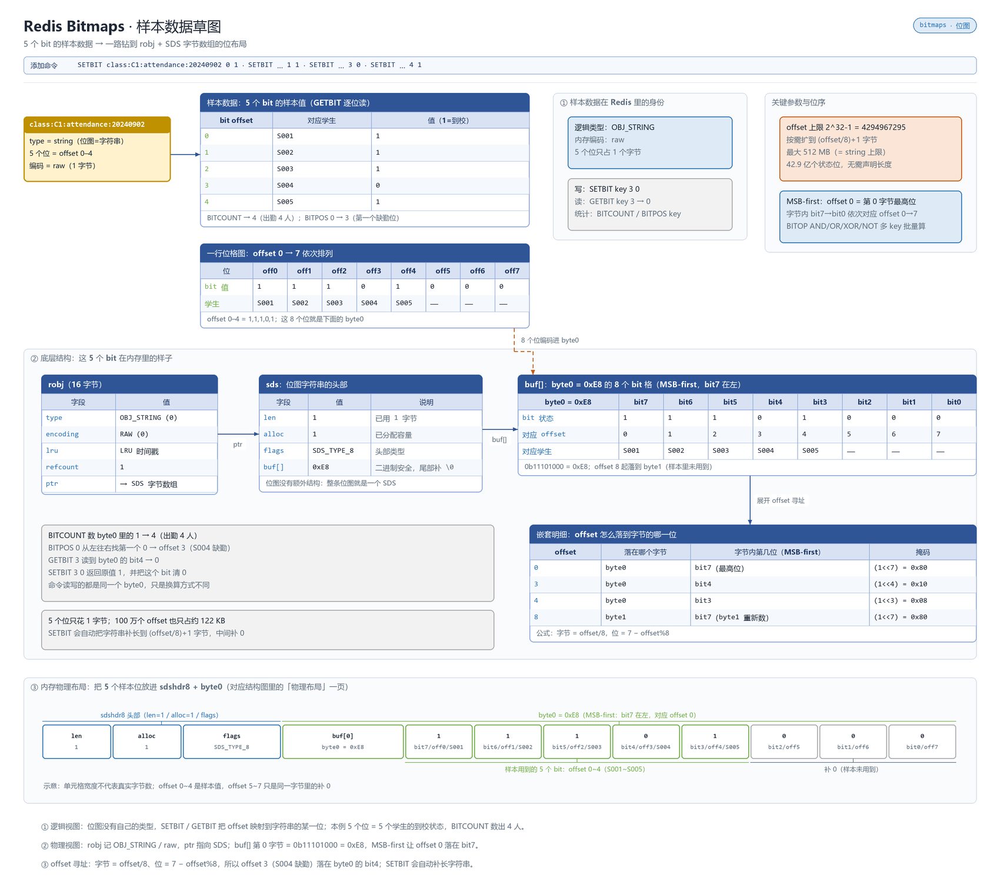

# 概述

Bitmaps 是在 String 上以位为单位进行操作的集合，每个 bit 表示一个布尔值，支持 SETBIT/GETBIT/BITCOUNT/BITOP 等命令，1 bit 即可存储一个状态。

- 归属与可用性：Redis 开源核心类型（2.6+）
- 官方文档：<https://redis.io/docs/latest/develop/data-types/bitmaps/>

Bitmaps 不是独立类型，而是 String 的位视图：最大 2^32-1 个偏移（512MB value 上限），位偏移从低位开始编号。

# 数据存储结构

Bitmaps 不是一个独立类型，而是一个 **String**：把每字节当作 8 个 bit 位来寻址，编码与 String 相同（`raw`/`embstr`），`SETBIT` 设高位时按零填充扩展底层 SDS。

**动画：结构与写入演化**


**草图：样本数据在内存里的真实布局**



> 上面是 Bitmaps 自己的布局；所有 value 都挂在 `redisObject`（robj）上，`type` 定逻辑类型、`encoding` 定内存布局并随规模自动切换。robj 结构、各类型编码全景与 `OBJECT ENCODING` 调试方式，统一见 [030.value 底层原理](../09.原理与源码/030.value底层原理.md#编码全景)。

# 命令速查

| 命令 | 说明 | 复杂度 |
|------|------|--------|
| `SETBIT key offset 0\|1` | 置位（超出当前长度自动补零扩展） | O(1) |
| `GETBIT key offset` | 读单个位 | O(1) |
| `BITCOUNT key [start end [BYTE\|BIT]]` | 统计 1 的个数（6.2+ 支持 BIT 索引） | O(N) |
| `BITPOS key bit [start end [BYTE\|BIT]]` | 找第一个 0/1 的位 | O(N) |
| `BITOP AND\|OR\|XOR\|NOT dest key...` | 多键位运算落键 | O(N) |
| `BITOP DIFF\|DIFF1\|ANDOR\|ONE ...` | 8.2 新增运算符（见 [Redis 8.2](../10.Redis%20版本特性/050.Redis8.2.md)） | O(N) |
| `BITFIELD` | 位域复合读写（归属 [Bitfields](./080.Bitfields%20位域.md)） | — |

# 典型场景

1. **用户签到**：`SETBIT sign:{uid}:{yyyyMM} {day} 1`，当月连续天数 `BITCOUNT`，任意两天对比 `BITOP AND` 后计数；31 天/人只占 4 字节。
2. **在线/活跃状态**：`SETBIT online:{date} {uid} 1` + `BITCOUNT` 得日活——千万级用户仅 MB 级内存，是 [HyperLogLog](./140.HyperLogLog%20基数估计.md) 的"精确版"替代。
3. **连续行为判定**：`BITOP AND on:yesterday on:today both` → 对 both `BITCOUNT` 得"连续两日在线"。
4. **标签/布尔属性压缩**：配合 `BITFIELD` 把多个 0/1 标志位压进同一个键（见位域篇）。

# 操作示例

## 每日出勤签到

```bash
# 样本数据：C1 学号尾号 1~5 映射为位偏移 0~4，2024-09-02 除 S004 外均到校
redis-cli SETBIT "class:C1:attendance:20240902" 3 0    # S004 缺勤（返回原值 1）
redis-cli GETBIT "class:C1:attendance:20240902" 3       # 0
redis-cli BITCOUNT "class:C1:attendance:20240902"       # 出勤人数：4
redis-cli BITPOS "class:C1:attendance:20240902" 0        # 第一个缺勤位：3
```

5 人/天仅占 1 字节；批量报表时对各日期键 `BITCOUNT` 即可，无需拉回出勤明细。

## 作业提交次数统计

```bash
# 样本：S001 的 2024S1 学期 20 次作业，前 18 次提交（偏移 0~17 置 1）
redis-cli SETBIT "student:S001:homework:2024S1" 0 1
redis-cli SETBIT "student:S001:homework:2024S1" 17 1
redis-cli BITCOUNT "student:S001:homework:2024S1"       # 已交次数 = 置位数
```

## 连续两日都到校 / 前日到校日到缺勤（BITOP 组合）

```bash
# 2024-09-02 = 11101，09-03 = 10111（位偏移 0~4）
redis-cli BITOP AND "class:C1:attendance:keep" "class:C1:attendance:20240902" "class:C1:attendance:20240903"
redis-cli BITCOUNT "class:C1:attendance:keep"               # 两天都到校的人数
# 8.2+：前日在校当日缺勤，一步求差，不再需要 NOT+AND 两段拼装
redis-cli BITOP DIFF "class:C1:attendance:absent" "class:C1:attendance:20240902" "class:C1:attendance:20240903"
redis-cli BITCOUNT "class:C1:attendance:absent"
```

# 避坑

- **位偏移决定内存**：`SETBIT k 1000000000 1` 会分配约 125MB！uid 不连续时先映射成连续 id（自增/取模），或改用 Hash 建模。参见 [070.大key与热key](../08.工程化/070.大key与热key.md)。
- **BITCOUNT/BITOP 是 O(N)**：亿级位图逐条统计可阻塞毫秒~秒级，聚合统计走离线任务或增量维护计数键。
- **BITOP NOT 只接单源键**，且 dest 与 src 长度不等时按最长者补零，容易算出"惊喜结果"——先确认各键覆盖范围。
- 签到跨月键设计要用 `EXPIRE` 清理历史位图，否则"日活位图"逐年堆积。
- `BITPOS key 0` 在全 1 位图返回 -1；空键时 `BITCOUNT` 为 0 而非报错。

# 总结

- Bitmap = String 的位视图：**以 bit 换内存**，亿级布尔状态（签到/在线/消息已读）的唯一低成本解；
- 单键统计用 BITCOUNT/BITPOS，跨键组合用 BITOP（8.2 起 DIFF/ANDOR 等少写一半命令）；
- 用之前先解决"偏移稀疏"问题——uid 映射成连续 id 是位图工程落地的第一步。
