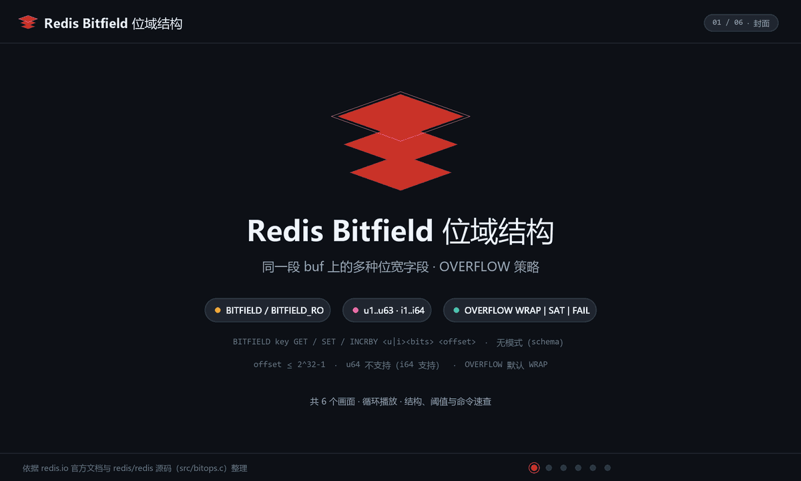
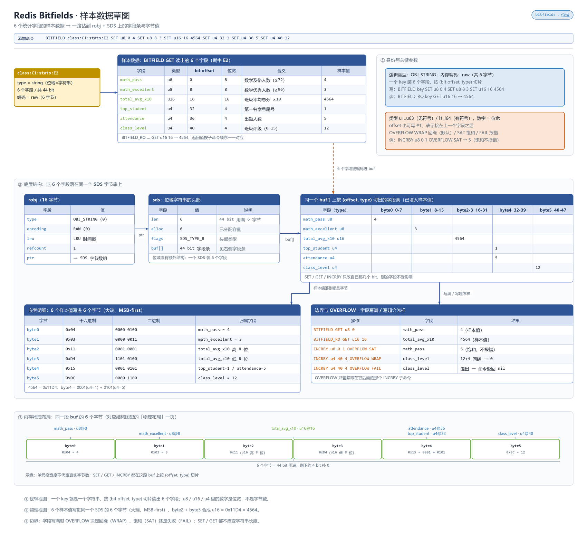

# 概述

Bitfields 将 String 视为位数组，对任意位宽（1~64 位有符号、1~63 位无符号）的整数字段进行读写和原子增减，支持多种溢出策略。

- 归属与可用性：Redis 开源核心类型（3.2+）
- 官方文档：<https://redis.io/docs/latest/develop/data-types/bitfields/>

单条 `BITFIELD` 可携带多个子操作（GET/SET/INCRBY/OVERFLOW），**按顺序原子执行**——这是它与"多条 SETBIT"最本质的区别。

# 数据存储结构

Bitfields 同样是 **String**（`raw`/`embstr`），只是把一段位区间按自定义位宽打包成多个整数字段，一次 `BITFIELD` 读写/增减多位，高位偏移会按零扩展底层字节。

**动画：结构与写入演化**



**草图：样本数据在内存里的真实布局**



> 上面是 Bitfields 自己的布局；所有 value 都挂在 `redisObject`（robj）上，`type` 定逻辑类型、`encoding` 定内存布局并随规模自动切换。robj 结构、各类型编码全景与 `OBJECT ENCODING` 调试方式，统一见 [030.value 底层原理](../09.原理与源码/030.value底层原理.md#编码全景)。

# 命令速查

| 语法 | 说明 |
|------|------|
| `BITFIELD key GET u8 100` | 读偏移 100 起的 8 位无符号整数（`i8` 为有符号） |
| `BITFIELD key SET i16 #3 500` | `#3` 表示"类型宽 × 3"的逻辑索引写法（等价偏移 48） |
| `BITFIELD key INCRBY u7 0 1` | 原子自增，返回新值 |
| `BITFIELD key OVERFLOW WRAP\|SAT\|FAIL INCRBY u4 0 1` | 声明其后子操作的溢出策略：**WRAP** 回绕（默认）、**SAT** 饱和截断、**FAIL** 返回 nil 不改动 |
| `BITFIELD_RO key GET u8 0 ...` | 只读版（6.2+），Cluster 只读节点可用 |

一条命令示例（多操作 + 混合溢出）：

```
BITFIELD player:1000
  SET u4#0 3
  OVERFLOW SAT INCRBY u12#1 20
  GET u4#0
```

注意：`OVERFLOW` 只影响其后的**第一个**子操作，需紧贴要约束的那条 `SET`/`INCRBY`。

# 典型场景

1. **游戏状态压缩**：等级(u8)+血量(u12)+金币(u32)+VIP 标志(u1) 压进一个键，几十位内存完成"多字段原子更新"。
2. **紧凑型计数器**：u5 计数 + SAT 策略，天然封顶不越界，适合"每日限 N 次"配额。
3. **多标志位管理**：把 N 个布尔开关排布为连续位段，GET 一次取回全部状态。
4. **实时指标聚合**：按设备分片把读数 INCRBY 进定宽字段，替代海量 String 计数键（见 [070.Bitmaps 位图](./070.Bitmaps%20位图.md)）。

# 操作示例

## 班级统计紧凑结构

```bash
# 样本位段布局（绝对位偏移）：u8@0=数学及格数，u8@8=优秀数，u16@16=平均总分×10
redis-cli BITFIELD "class:C1:stats:E2" SET u8 0 4 SET u8 8 3 SET u16 16 4564 \
                             SET u4 32 1 SET u4 36 5 SET u4 40 12
redis-cli BITFIELD "class:C1:stats:E2" GET u8 0 GET u8 8 GET u16 16   # 4 / 3 / 4564
```

六个字段压进不足 6 字节，一次往返读回全部统计。

## 原子多操作：及格数 +1 + 回读

```bash
# 单命令按顺序原子执行，不会读到“加了及格数没改总分”的中间态
redis-cli BITFIELD "class:C1:stats:E2" INCRBY u8 0 1 GET u8 0
```

## 出勤人数封顶（u4 + SAT）

```bash
# u4 可表达 0~15，SAT 策略超界钉住不回绕（默认 WRAP 会 15→0）
redis-cli BITFIELD "class:C1:stats:E2" OVERFLOW SAT INCRBY u4 36 1
redis-cli BITFIELD "class:C1:stats:E2" GET u4 36      # 出勤人数（最多钉在 15）
```

## 只读副本上统计

```bash
# BITFIELD_RO（6.2+）：纯读子操作可路由到副本分流，主库减压
redis-cli BITFIELD_RO "class:C1:stats:E2" GET u16 16 GET u4 40
```

# 避坑

- **默认 WRAP 会静默回绕**：u4 计到 15 再 +1 变 0，配额/库存等场景必须显式 `OVERFLOW SAT` 或 `FAIL` 并处理 nil 返回。
- 位宽上限：有符号 64 位、无符号 63 位；超过直接语法错误。
- 偏移越界会**隐式扩容字符串**——与位图同样的"高位偏移=大 key"风险（`BITFIELD k GET u8 4000000000` 分配 500MB）。参见 [070.大key与热key](../08.工程化/070.大key与热key.md)。
- 字段位置是"位级布局"，**改版扩容字段宽度 = 数据迁移**——上线前用位段规划文档锁死布局。
- 与 Bitmaps 混用同一键时注意语义冲突（位 vs 位段），一个键只选一种建模。

# 总结

- Bitfields 是"位级多字段结构体"：一条命令原子完成定宽整数的读/写/增，省内存又保原子性；
- 溢出的三策略（WRAP/SAT/FAIL）是核心考点，配额场景务必显式声明；
- 适合小规模定长状态压缩，字段多且需要独立 TTL 时回到 Hash（7.4 字段过期）。
