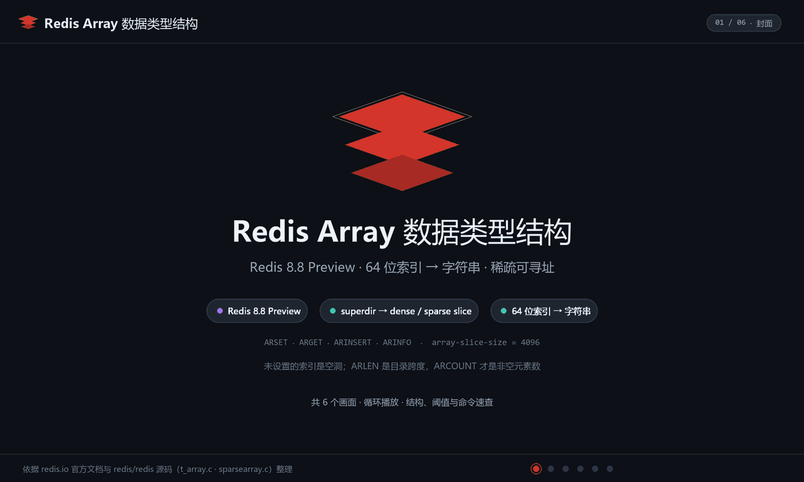
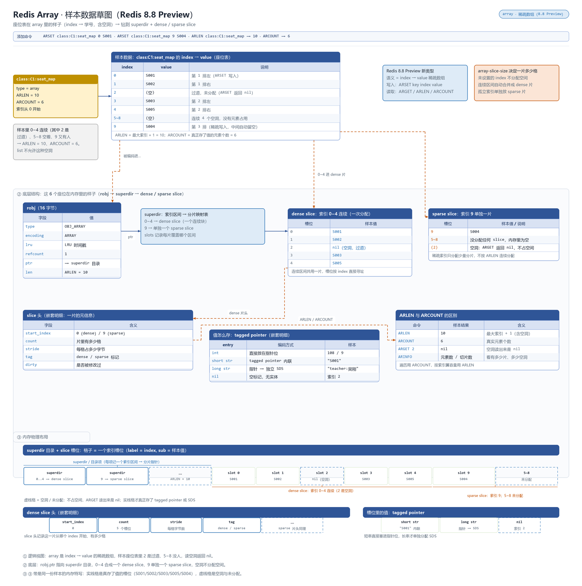

# 概述

Array 是**稀疏的、可按整数索引寻址**的序列类型：索引即位置、按需分配，`ARGETRANGE` 范围读、服务端聚合（`AROP`）、环形缓冲（`ARRING`）都是一等公民。

- 归属与可用性：**Redis 开源核心类型（8.8+）**，原生内置、无需加载模块（见 [Redis 8.8 版本特性](../10.Redis%20版本特性/080.Redis8.8.md)）
- 官方文档：<https://redis.io/docs/latest/develop/data-types/>（命令表 Array commands 分组，18 条 `AR*` 命令）

与 List 的本质分工：List 是"两端 O(1)、中间 O(N)"的链表，Array 是**按索引 O(1) 寻址的稀疏数组**——写入高位索引只分配所在段，不为空洞付费。`ARLEN`（最大索引+1）与 `ARCOUNT`（非空元素数）分离，正是稀疏性的直接体现。写入游标由 `ARINSERT`/`ARRING` 共享，可用 `ARSEEK` 定位、`ARNEXT` 窥探。

# 数据存储结构

Array 是 8.8 起的原生稀疏可寻址序列：只在实际写入的高位索引处分配内存，设置大索引不会预先占大量空间，连续区段以紧凑块存储。

**动画：结构与写入演化**



**草图：样本数据在内存里的真实布局**



> 上面是 Array 自己的布局；所有 value 都挂在 `redisObject`（robj）上，`type` 定逻辑类型、`encoding` 定内存布局并随规模自动切换。robj 结构、各类型编码全景与 `OBJECT ENCODING` 调试方式，统一见 [030.value 底层原理](../09.原理与源码/030.value底层原理.md#编码全景)。

# 命令速查

| 命令 | 说明 | 复杂度 |
|------|------|--------|
| `ARSET key index v [v...]` | 从指定索引起连续写入 | O(N) |
| `ARGET key index` | 单点取值 | O(1) |
| `ARGETRANGE key start end` | 区间读取 | O(N) |
| `ARMGET key index [index...]` / `ARMSET key i v [i v...]` | 多下标批量读 / 批量写 | O(N) |
| `ARINSERT key v [v...]` | 在写游标处追加 | O(N) |
| `ARNEXT key` / `ARSEEK key index` | 窥探 / 设置 `ARINSERT`、`ARRING` 的游标 | O(1) |
| `ARRING key size v [v...]` | 写入固定容量**环形缓冲**，越界回绕并覆盖最旧 | O(N) |
| `ARLEN key` / `ARCOUNT key` | 长度（最大索引+1）/ 非空元素数 | O(1) |
| `ARDEL key index [index...]` / `ARDELRANGE key start end [start end ...]` | 按下标删 / 按区间删（可多段），留空洞 | O(N) |
| `ARGREP key start end <EXACT\|MATCH\|GLOB\|RE p> [AND\|OR] [LIMIT n] [WITHVALUES] [NOCASE]` | 区间内文本检索（精确/子串/通配/正则） | O(N) |
| `AROP key start end <SUM\|MIN\|MAX\|AND\|OR\|XOR\|MATCH v\|USED>` | 服务端区间聚合（数值求和/极值/位运算/计数） | O(N) |
| `ARSCAN key start end [LIMIT n]` | 区间迭代，返回索引-值对（跳过空洞） | O(N)/次 |
| `ARINFO key [FULL]` / `ARLASTITEMS key count [REV]` | 元数据 / 最近写入的 N 项 | O(1) / O(N) |

# 典型场景

1. **环形缓冲（最有辨识度的用法）**：`ARRING log:tail 1000 <line>` 固定保留最近 1000 条，自动回绕覆盖最旧，无需 `LTRIM`，内存封顶——日志尾窗、监控采样天然合用。
2. **时间片索引的传感器序列**：`ARSET readings:{dev} <epoch/60> value`，点查任意时间片 O(1)，空洞时段不占内存；聚合用 `AROP ... SUM/MAX` 在服务端完成。
3. **按位补写的时间线**：既顺序追加（`ARINSERT`）又允许回填历史位点（`ARSET` 指定索引），List 的 `LSET` O(N) 痛点在此是 O(1)。
4. **定长槽位表**：座位/棋盘/分片状态等"索引即业务编号"的建模，`ARMGET`/`ARMSET` 批量读写占用位。
5. **文本检索小语料**：`ARGREP docs 0 -1 RE "error.*timeout" WITHVALUES` 服务端正则过滤，省去全量 `ARGETRANGE` 拉回客户端。

# 操作示例

## 座位表：稀疏随机写与空洞观测

```bash
# 样本数据：C1 座位图，index=座位号，过道/未分配位（index 2）留空洞
redis-cli ARSET "class:C1:seat_map" 0 S001
redis-cli ARSET "class:C1:seat_map" 9 S004            # 稀疏，中间索引自动留空
redis-cli ARGET "class:C1:seat_map" 9                 # "S004"
redis-cli ARGET "class:C1:seat_map" 2                 # (nil) 过道未分配
redis-cli ARLEN "class:C1:seat_map"                   # 10（最大索引+1）
redis-cli ARCOUNT "class:C1:seat_map"                 # 6（真正非空的只有 6 个）
redis-cli ARSCAN "class:C1:seat_map" 0 1000 LIMIT 10  # 跳过空洞迭代已占位
```

## 考试序列：按下标取历史成绩

```bash
# 样本数据：S001 按考试序号依次参加 E1/E2/E3
redis-cli ARSET "student:S001:exam_seq" 0 E1 E2 E3
redis-cli ARGET "student:S001:exam_seq" 1             # "E2"（期中考）
redis-cli AROP "student:S001:exam_seq" 0 -1 USED       # 已填考试次数：3
```

## 轮岗环形缓冲（ARRING）

```bash
# C1 五人值日轮岗：固定 5 个写游标位，写满自动回绕覆盖最旧
redis-cli ARRING "duty:C1:week" 5 S001 S002 S003 S004 S005
redis-cli ARRING "duty:C1:week" 5 S001                # 新一周回绕覆盖最旧
redis-cli ARLASTITEMS "duty:C1:week" 2 REV          # 最近 2 个值日生
```

## 区间检索（ARGREP）

```bash
# 在座位表中找学号前缀为 S00 的学生座位
redis-cli ARGREP "class:C1:seat_map" 0 -1 GLOB "S00*" WITHVALUES
```

# 避坑

- **8.8 版本闸门**：低版本执行 `AR*` 直接 unknown command，接入前 `COMMAND INFO ARSET` 确认；集群滚动升级期间勿提前灰度依赖 Array 的功能。
- **`ARDEL` 留空洞**：删出的洞不回收索引空间，`ARLEN` 不变；大量删除后靠多段 `ARDELRANGE` 整理或重建，别拿 `ARLEN` 当"还有多少数据"用（那是 `ARCOUNT`）。
- **游标是共享状态**：`ARINSERT` 与 `ARRING` 共用写游标，多生产者交替写会互相推进位置，需要各自独立追加位点时改用 `ARSET` 显式索引或拆分键。
- **`ARRING` 覆盖不可逆**：容量调小（换键重建）或写满后的覆盖都会丢最旧数据，回放型场景请配 `XADD` Stream。
- 与邻居的边界：两端阻塞弹出/任务队列 → List；消息确认与消费组 → Stream；按索引随机访问/环形缓冲 → Array。
- Cluster 下仍是**整键操作**，巨型 Array 与大 Hash 同病：不可按元素拆分迁移，单键规模要有上限。参见 [070.大key与热key](../08.工程化/070.大key与热key.md)。

# 总结

- Array 自 8.8 起成为开源核心类型，补上"**按索引 O(1) 寻址 + 稀疏存储 + 服务端聚合/检索**"生态位；
- `ARRING` 一条命令顶过去"List + LTRIM + 取模索引"整套拼装，是环形缓冲的原生解；
- 选型口诀：队列看 List、消息看 Stream、**按下标说话看 Array**；用前确认 8.8+。
