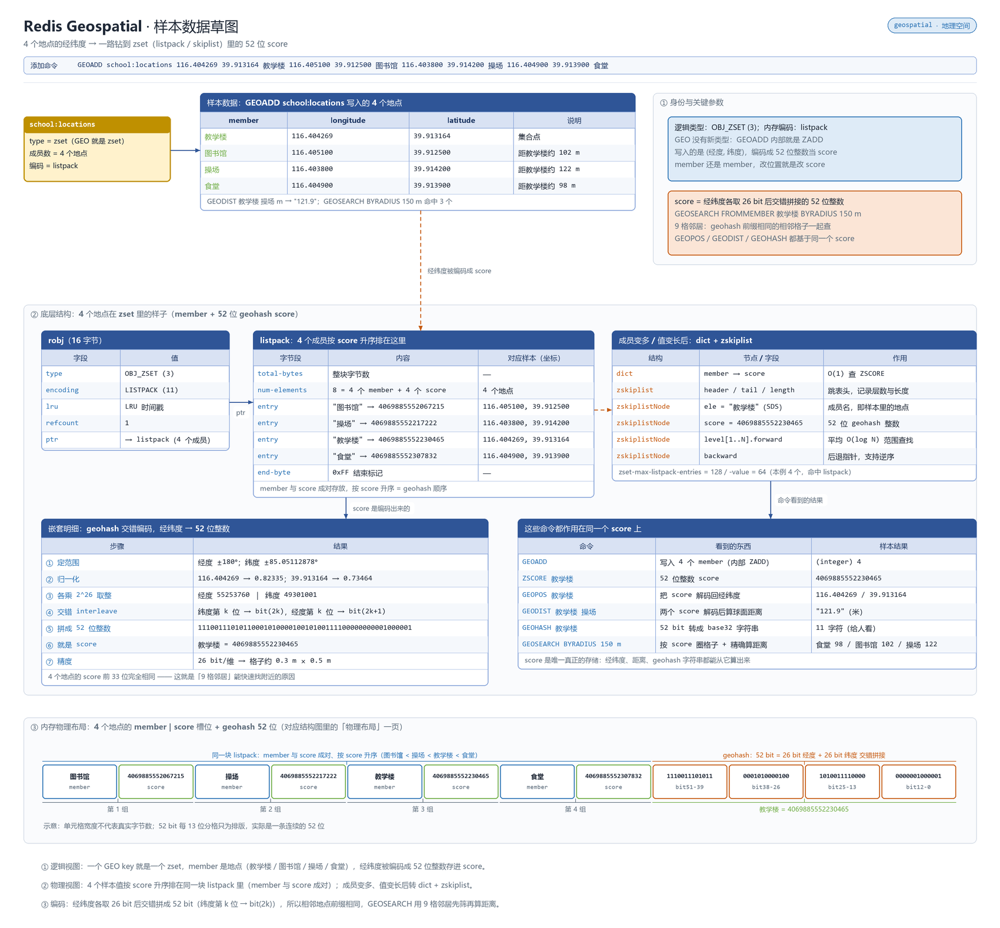

# 概述

Geospatial 基于 Sorted Set 实现（使用 Geohash 算法编码经纬度到 score），支持半径查询、边界框查询和距离计算，并非独立数据类型。

- 归属与可用性：Redis 开源核心命令集（3.2+，底层即 [Sorted Set](./050.Sorted%20Set%20有序集合.md)）
- 官方文档：<https://redis.io/docs/latest/develop/data-types/geospatial/>

经纬度对被编码为 52 位 Geohash 存入 score，因此**所有 ZSet 命令对地理键同样有效**（如 `ZCARD` 数成员）；编码有精度上限（赤道附近误差约 0.6 米级），不是坐标系级精确方案。

# 数据存储结构

Geospatial 不是独立类型——它用 **Sorted Set** 存：把经纬度编码成 52 位 Geohash 塞进 score，复用底层的 `listpack`/`skiplist`+`dict`，因此半径/距离查询本质是跳表上的范围检索。

**动画：结构与写入演化**


**草图：样本数据在内存里的真实布局**



> 上面是 Geospatial 自己的布局；所有 value 都挂在 `redisObject`（robj）上，`type` 定逻辑类型、`encoding` 定内存布局并随规模自动切换。robj 结构、各类型编码全景与 `OBJECT ENCODING` 调试方式，统一见 [030.value 底层原理](../09.原理与源码/030.value底层原理.md#编码全景)。

# 命令速查

| 命令 | 说明 | 复杂度 |
|------|------|--------|
| `GEOADD key lng lat member [lng lat member...]` | 添加/更新坐标（经度在前！） | O(log N) |
| `GEOPOS key member...` | 回读坐标（返回值有编码截断） | O(N) |
| `GEODIST key m1 m2 [m\|km\|mi\|ft]` | 两点球面距离 | O(log N) |
| `GEOSEARCH key FROMLONLAT lng lat \| FROMMEMBER m BYRADIUS r <unit> \| BYBOX w h <unit> [ASC\|DESC] [COUNT n [ANY]] [WITHCOORD\|WITHDIST\|WITHHASH]` | 6.2+ 统一检索入口：圆/矩形范围查询 | O(N+log N) |
| `GEOSEARCHSTORE dest src ... [STOREDIST]` | 结果落键（可直接当 ZSet 用） | O(N+log N) |
| `GEORADIUS` / `GEORADIUSBYMEMBER` | 旧命令，6.2 起被 GEOSEARCH 取代，新代码勿用 | — |

# 典型场景

1. **附近的人/店**：`GEOSEARCH shops FROMLONLAT 121.47 31.23 BYRADIUS 5 km ASC COUNT 20 WITHCOORD WITHDIST`。
2. **电子围栏判定**：`GEODIST car:1 depot m` 与阈值比较，或 `GEOSEARCH ... BYBOX ... COUNT 1` 判断"是否在矩形区域内"。
3. **配送范围筛选落键**：`GEOSEARCHSTORE result shops FROMMEMBER central BYRADIUS 3 km STOREDIST`，得到"距离当分数"的 ZSet 供后续分页。
4. **地图视窗拉取**：随地图拖动不断 `BYBOX` 取当前视野内点位。

# 操作示例

## 校园附近地点（GEOSEARCH）

```bash
# 注意：经度在前、纬度在后（样本：阳光中学校园地点）
redis-cli GEOADD "school:locations" 116.404269 39.913164 教学楼 116.405100 39.912500 图书馆 116.403800 39.914200 操场 116.404900 39.913900 食堂
# 以教学楼为中心，150 米内最近 3 个地点，带距离与坐标
redis-cli GEOSEARCH "school:locations" FROMLONLAT 116.404269 39.913164 BYRADIUS 150 m ASC COUNT 3 WITHDIST WITHCOORD
```

## 两点距离与到楼围栏判定

```bash
redis-cli GEODIST "school:locations" 教学楼 操场 m      # 约 "121.9"
# 学生 S001 是否在教学楼 100m 内：COUNT 1 有返回即在栏内，省掉全量拉取
redis-cli GEOADD "class:C1:students:position" 116.404300 39.913200 S001
redis-cli GEOSEARCH "class:C1:students:position" FROMMEMBER S001 BYRADIUS 100 m COUNT 1
```

## 结果落键，复用 ZSet 分页

```bash
# 半径内地点存成新键，score = 到中心的距离（STOREDIST）
redis-cli GEOSEARCHSTORE "result:school:150m" "school:locations" FROMLONLAT 116.404269 39.913164 BYRADIUS 150 m STOREDIST COUNT 100 ASC
redis-cli ZRANGE "result:school:150m" 0 9 WITHSCORES    # 第一页，score 即米数
redis-cli ZCARD "result:school:150m"                     # 总数——地理键就是 ZSet
```

# 避坑

- **经度在前、纬度在后**（`lng lat`），与直觉"经纬度"顺序相反——写反后坐标落到索马里海域是经典事故。
- **纬度 |lat| > 85.05 直接报错**（Web Mercator 限制）。
- **精度有损**：GEOPOS 返回的是 Geohash 解码值，与写入值有微小差异；需要精确坐标请另存（Hash/JSON）。
- 海量点位（百万级成员）时 GEOSEARCH 退化为近似全扫——按地理分片（城市/网格）拆 key，先粗筛再细查。
- member 可重复写入即更新坐标，但**同一键内成员唯一**：一个实体多坐标要拆键。
- 别把 GEORADIUS 当"半径圈内全部返回"用：不加 `COUNT ... ANY` 的大半径查询会拖垮单线程。参见 [070.大key与热key](../08.工程化/070.大key与热key.md)。

# 总结

- 地理类型 = Sorted Set + Geohash：**会 ZSet 就等于会地理查询的一半**；
- 新代码一律 `GEOSEARCH`/`GEOSEARCHSTORE`，半径/矩形/排序/分页一条命令搞定；
- 接受"米级近似"的定位场景（附近、围栏、视野）才适合它，精确坐标存储请另设字段。
