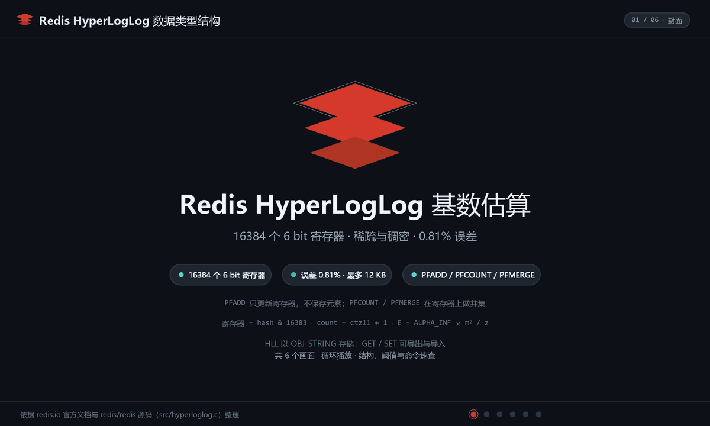
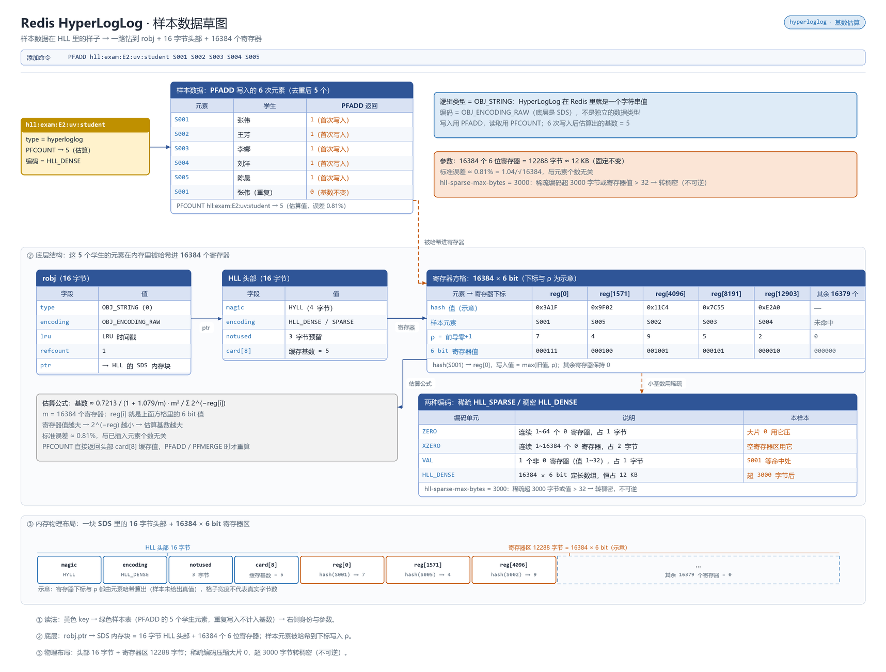

# 概述

HyperLogLog 是概率型基数估计结构，用固定约 12KB 内存统计十亿级去重元素，标准误差约 0.81%，适合"只要数量、不要明细"的 UV/去重计数场景。

- 归属与可用性：Redis 开源核心类型（2.8.9+）
- 官方文档：<https://redis.io/docs/latest/develop/data-types/probabilistic/hyperloglogs/>

原理是观察元素哈希值前导零的个数来估算基数：基数越大，出现"前导零很多"的哈希的概率越高。它**不存储元素本身**，因此无法回答"某个人来过没有"，也**不能删除单个元素**（只能整键重置）。

# 数据存储结构

HyperLogLog 是定长概率结构：基数小时用 `sparse` 稀疏编码省内存，超过阈值自动转 `dense`（固定 12KB、16384 个寄存器），无论统计多少元素内存不涨。

**动画：结构与写入演化**



**草图：样本数据在内存里的真实布局**



> 上面是 HyperLogLog 自己的布局；所有 value 都挂在 `redisObject`（robj）上，`type` 定逻辑类型、`encoding` 定内存布局并随规模自动切换。robj 结构、各类型编码全景与 `OBJECT ENCODING` 调试方式，统一见 [030.value 底层原理](../09.原理与源码/030.value底层原理.md#编码全景)。

# 命令速查

| 命令 | 说明 | 复杂度 |
|------|------|--------|
| `PFADD key [element...]` | 添加元素（不带 element 时仅创建空结构）；元素可能新增返回 `1`，大概率已存在返回 `0` | O(1) |
| `PFCOUNT key [key...]` | 估算基数；多键时临时合并计算**且不写回** | O(1)（多键近似 O(N)） |
| `PFMERGE destkey sourcekey [sourcekey...]` | 合并多个 HLL 落键（合并后再 `PFCOUNT` 可复用结果） | O(N) |
| `DEL key` | 通用命令即可销毁整键 | O(1) |

编码自动切换：基数小时用 **sparse** 稀疏编码（内存远低于 12KB），元素增多后转 **dense** 稠密编码（固定 12KB），由 `hll-sparse-max-bytes` 控制转换点。

# 典型场景

- **页面/活动 UV**：`PFADD uv:page:20260925 uid_1 uid_2 ...` 按天分键，报表 `PFCOUNT uv:page:*` 或先 `PFMERGE` 再读；一天千万访问也只占 12KB/键。
- **跨渠道去重汇总**：各渠道独立 HLL，周/月大盘 `PFMERGE uv:week uv:day1 uv:day2 ...` 后 `PFCOUNT`——注意这是**近似并集**，误差小于直接相加的重叠偏差。
- **爬虫/推送去重判断的前置过滤**：先 `PFADD` 看返回值粗判"是否新访客池"，真需要精确成员判断时改用 Set 或 Bloom（见 [Bloom Filter](./150.Bloom%20Filter%20布隆过滤器.md)）。

# 操作示例

## 考试参考人数去重统计

```bash
# 一个命令带多个学生上报，重复参考自动去重（样本：E2 数学 5 人参考）
redis-cli PFADD "hll:exam:E2:uv:student" S001 S002 S003 S004 S005
redis-cli PFCOUNT "hll:exam:E2:uv:student"        # 估算结果 ≈ 5，整键仅占 12KB
```

## 学期大盘：多试合并算并集

```bash
redis-cli PFMERGE "hll:2024S1:uv:student" "hll:exam:E1:uv:student" "hll:exam:E2:uv:student"
redis-cli PFCOUNT "hll:2024S1:uv:student"          # 跨考试重复学生不会重复计数
# 大盘高频读：定时任务落汇总键，而不是每次都 PFCOUNT 多键现场合并
```

## 科目答疑去重 + 新生粗判

```bash
redis-cli PFADD "hll:subject:SUB2:visitors" S001
redis-cli PFADD "hll:daily:20240928:uv" S001
redis-cli PFCOUNT "hll:subject:SUB2:visitors" "hll:daily:20240928:uv"   # 多键临时求并集，不写回
# PFADD 返回 1 = 可能是新学生；返回 0 = 大概率已见过（仅作粗筛，勿做精确判存）
```

# 避坑

- **它不是集合**：`SISMEMBER` 之类“成员是否存在”的问题一律无解；误用等于给自己埋需求炸弹——要么 Set，要么 Bloom，要么接受只有总数。
- **误差是相对的**：0.81% 标准误差在基数 1000 时约 ±8，基数 1 亿时约 ±81 万；对精确对账、计费等场景禁用。
- **不能删除元素**：只能整键 `DEL` 重建；需要"可删除的计数"考虑 Cuckoo Filter（见 [Cuckoo Filter](./160.Cuckoo%20Filter%20布谷鸟过滤器.md)）或改用 Set。
- **多键 `PFCOUNT key...` 不缓存合并结果**：高频大盘查询应定时 `PFMERGE` 落一个汇总键，别每次都现场合并。
- sparse 编码阶段内存会随元素波动膨胀，监控看到的"某 HLL 键 12KB 封顶"只在 dense 后成立。

# 总结

HyperLogLog 用"固定 12KB + 0.81% 误差"换来无上限的去重计数规模，是 UV 类指标的默认答案。使用时先过三道判断题：需不需要成员判断（需要→换 Set/Bloom）？需不需要精确值（需要→换 Set/落库）？需不需要删除元素（需要→整键重建或换结构）？三题都"否"，它几乎总是内存成本最低的最优解。按天/按维度分键 + 定时 `PFMERGE` 汇总，是最常见的生产形态。
