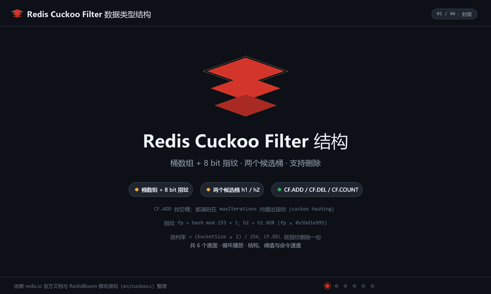
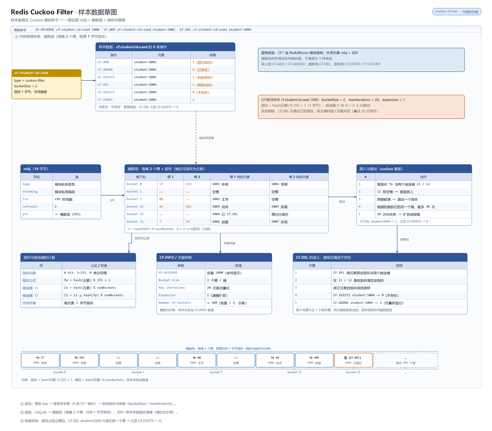

# 概述

Cuckoo Filter 是支持**删除**的概率型集合过滤器：判断"肯定不存在 / 可能存在"，与 Bloom Filter 的核心差异是 `CF.DEL` 可移除单个元素，且在同等误判率下通常更省内存（按指纹存储）。

- 归属与可用性：原 RedisBloom 模块能力，**自 Redis 6.2 起并入开源版**
- 官方文档：<https://redis.io/docs/latest/develop/data-types/probabilistic/cuckoo-filter/>

原理是"布谷鸟占地"式哈希：每个元素取 16 位**指纹（fingerprint）**存入两个候选桶之一，桶满时把已有指纹踢到对侧桶（反复踢动，超过上限则判定结构过满）。桶（bucket）默认 2 个槽，`BUCKET_SIZE` 可调。

# 数据存储结构

Cuckoo Filter 是模块类型：把元素哈希成短**指纹**存入分桶数组，桶满时将已有指纹“踢”到另一候选桶（cuckoo hashing）；因存的是指纹而非单个位，所以**支持删除**。

**动画：结构与写入演化**



**草图：样本数据在内存里的真实布局**



> 上面是 Cuckoo Filter 自己的布局；核心类型的 value 都挂在 `redisObject`（robj）上、`encoding` 随规模自动切换（模块类型编码自成一套）。robj 结构与各类型编码全景统一见 [030.value 底层原理](../09.原理与源码/030.value底层原理.md#编码全景)。

# 命令速查

| 命令 | 说明 | 复杂度 |
|------|------|--------|
| `CF.RESERVE key capacity [BUCKET_SIZE n] [EXPANSION e] [MAX_ITERATIONS i]` | 显式创建（capacity 为预期条目数，非精确上限；`EXPANSION 0` 禁止扩容） | O(1) |
| `CF.ADD key item` | 添加（键不存在时按默认参数自动创建） | O(1) |
| `CF.ADDNX key item` | 仅当"肯定不存在"时添加，返回是否写入——去重写入一体 | O(1) |
| `CF.INSERT key [CAPACITY c] [NOCREATE] ITEMS item...` / `CF.INSERTNX ...` | 批量添加 / 批量"不存在才加" | O(n) |
| `CF.EXISTS key item` / `CF.MEXISTS key item...` | 判断存在性 | O(1) |
| `CF.COUNT key item` | 该 item 在过滤器中出现的次数（指纹碰撞的估计值） | O(1) |
| `CF.DEL key item` | 删除一个匹配条目 | O(1) |
| `CF.REPLACE key item` | 若存在则删除并返回 1，否则添加并返回 0——"刷新即覆盖"语义 | O(1) |
| `CF.INFO key` / `CF.SCANDUMP` / `CF.LOADCHUNK` | 元数据 / 分块导出导入 | O(1) |

# 典型场景

- **可撤销的访问门禁**：临时令牌/授权 ID 写入 `CF.ADDNX`，吊销时 `CF.DEL`——Bloom 做不到的"退出集合"在这里天然成立；适合缓存穿透防护中存在删除动作的变体。
- **账户/设备多指纹排查**：`CF.COUNT key device_id` 粗估同一设备的登录条目数，配合精确 Set 做二级核验。
- **短周期去重队列**：按小时分键 `CF.RESERVE dedupe:2026092518 1000000`，窗口过期整键 `DEL`，键内允许撤销个别误入条目。

# 操作示例

## 可撤销的学号占用登记（Bloom 做不到）

```bash
redis-cli CF.RESERVE "cf:student:id:used" 1000
redis-cli CF.ADDNX "cf:student:id:used" student:S001    # 不存在才写入：登记与去重一体
redis-cli CF.EXISTS "cf:student:id:used" student:S001    # 1 = 学号已占用
redis-cli CF.DEL "cf:student:id:used" student:S004       # 转学后释放立即拦截
redis-cli CF.EXISTS "cf:student:id:used" student:S004    # 0 = 肯定不存在，释放生效
```

## 小时窗口去重 + 批量写入

```bash
redis-cli CF.RESERVE "cf:checkin:2024092808" 1000
redis-cli CF.INSERTNX "cf:checkin:2024092808" ITEMS S001 S002 S001   # 重复的 S001 被拦
redis-cli EXPIRE "cf:checkin:2024092808" 7200         # 窗口过期整键丢弃
redis-cli CF.COUNT "cf:checkin:2024092808" S001         # 指纹级估计，碰撞会虚高
```

## 刷新即覆盖（REPLACE）

```bash
# 家长手机号换绑：返回 1 = 旧条目已被替换；返回 0 = 不存在旧条目，已新增
redis-cli CF.REPLACE "cf:phone:used" 13800000009
```

## 容量体检

```bash
redis-cli CF.INFO "cf:student:id:used"   # 看桶数/大小与条目数；写入开始报“过满”前应重建更大过滤器
```

# 避坑

- **误判方向与 Bloom 相同**："不存在"绝对可信，"存在"有假阳性；且 `CF.DEL` 删的是**一个匹配指纹的条目**，可能误删别人的槽位（指纹碰撞时删错对象）——删除不是 100% 精确配对。
- **踢动链过长即“过满”**：`MAX_ITERATIONS`（默认 20）耗尽会报“过滤器过满”；容量要给足，`CF.INFO` 观察桶数/大小与已写入条目数，逼近满就扩容重建，不要等报错。
- **`BUCKET_SIZE` 权衡**：调大省桶数但增加踢动长度与查询延迟，官方建议默认 2 起步，压测后再动。
- **别把它当计数容器**：`CF.COUNT` 是指纹级估计，碰撞会虚高；精确频次用 [Count-Min Sketch](./170.Count-Min%20Sketch%20计数最小略图.md) 或 Set。
- 与 Bloom 一样是**有状态概率结构**：重启/迁移要靠 `CF.SCANDUMP`/`CF.LOADCHUNK` 或业务重放，不要假设它能像 Set 一样从 AOF 恢复外再"随手导出"。

# 总结

Cuckoo Filter 补上了 Bloom Filter 缺失的那块拼图——**可删除**。选型口诀：只进不出、判"不存在"为主用 Bloom；需要撤销、刷新、或"不存在才写入"（`CF.ADDNX`）用 Cuckoo；要精确成员和计数回到 Set/Hash。代价要认清：删除遇指纹碰撞可能删错条目、过满时写入会失败，所以容量预算和 `CF.INFO` 监控在 Cuckoo 上比对 Bloom 更不可省。
