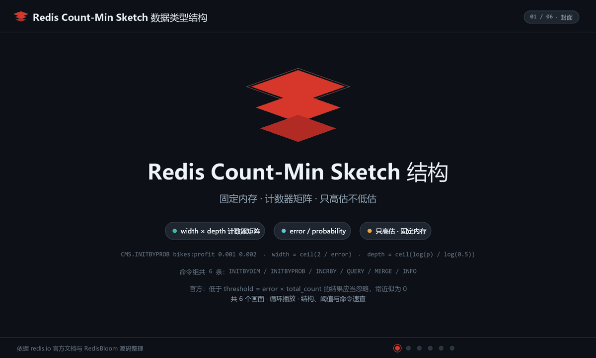
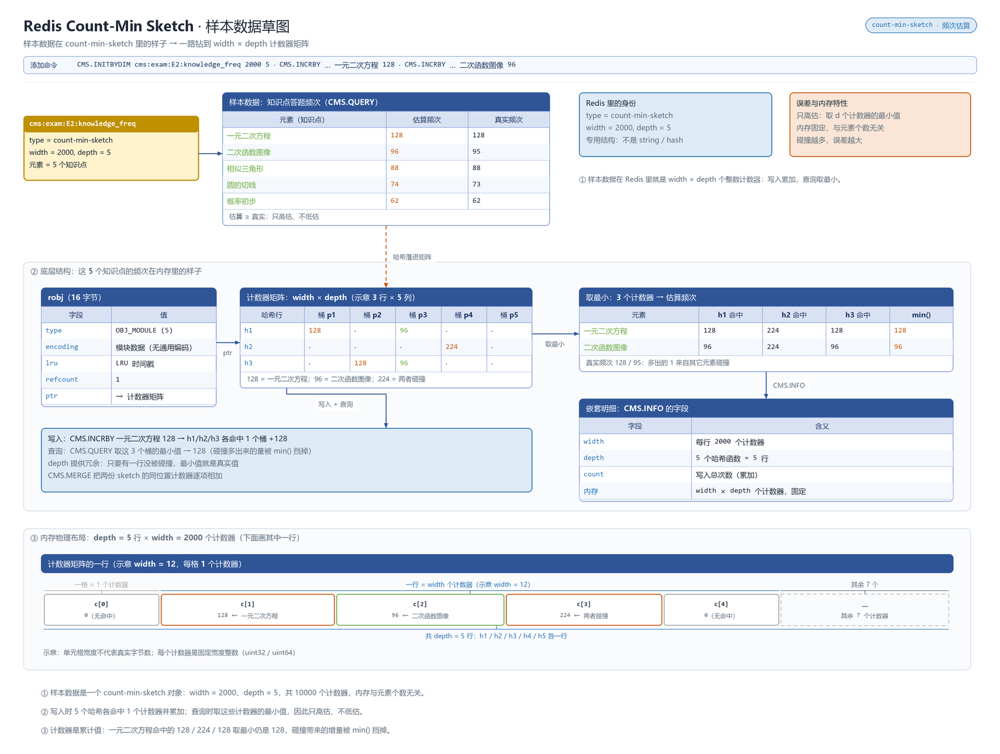

# 概述

Count-Min Sketch（CMS）是多哈希函数驱动的频率估计结构：以 `宽度 × 深度` 的计数矩阵估算任意 item 的出现频次，**只会高估、不会低估**，内存恒定。

- 归属与可用性：原 RedisBloom 模块能力，**自 Redis 6.2 起并入开源版**
- 官方文档：<https://redis.io/docs/latest/develop/data-types/probabilistic/count-min-sketch/>

误差由两个参数直接决定：`width`（`w`）控制频率分辨率，`depth`（`d`）控制碰撞概率——估计值与真实值的偏差上界约为 `总量/w`，超出该偏差的概率随 `d` 指数衰减。同一 item 跨行取**最小值**即最终估计（“count-min”之名由来）。

# 数据存储结构

Count-Min Sketch 是模块类型：一个 `width × depth` 的计数矩阵，每行用一个哈希函数定位列并自增；查询取各行中的**最小值**作为频次估计（只会高估不会低估）。

**动画：结构与写入演化**



**草图：样本数据在内存里的真实布局**



> 上面是 Count-Min Sketch 自己的布局；核心类型的 value 都挂在 `redisObject`（robj）上、`encoding` 随规模自动切换（模块类型编码自成一套）。robj 结构与各类型编码全景统一见 [030.value 底层原理](../09.原理与源码/030.value底层原理.md#编码全景)。

# 命令速查

| 命令 | 说明 | 复杂度 |
|------|------|--------|
| `CMS.INITBYDIM key width depth` | 按矩阵尺寸创建（如 `1000 5`） | O(1) |
| `CMS.INITBYPROB key error probability` | 按误差预算创建：`error = 总量占比`（如 `0.001`）、`probability = 失败概率`（如 `0.001`），自动换算 w/d——**推荐入口** | O(1) |
| `CMS.INCRBY key item delta [item delta ...]` | 频次增减（delta 可为负实现"撤销"，但结果下限截 0） | O(d·n) |
| `CMS.QUERY key item [item ...]` | 查询估计频次 | O(d·n) |
| `CMS.MERGE destkey numkeys source [weight ...]` | 合并多个 CMS（按权重加权求和），适合时间窗口汇总 | O(d·w) |
| `CMS.INFO key` | 返回 width/depth/size | O(1) |

# 典型场景

- **热点探测**：商品点击 `CMS.INITBYPROB clicks:20260925 0.001 0.001` 后每次 `CMS.INCRBY clicks item_1`；找出"被点爆的 item"只需对候选集 `CMS.QUERY`，无需为每个 item 建计数器键——**key 基数决定它能否替代 Hash 计数**。
- **风控粗筛**：IP/设备分钟级请求频次监控，`CMS.QUERY` 超阈值触发限流（精确名单交给后续 Set/Bloom 核验）。
- **流量窗口汇总**：每窗口一个 CMS，窗口滚动时 `CMS.MERGE` 加权合并出近 N 小时视图，省去原始计数落库。

# 操作示例

## 知识点答题频次粗筛

```bash
# 样本：E2 各知识点答题计数，一元二次方程/二次函数图像/圆的切线...
redis-cli CMS.INITBYDIM "cms:exam:E2:knowledge_freq" 2000 5
redis-cli CMS.INCRBY "cms:exam:E2:knowledge_freq" 一元二次方程 128 二次函数图像 95 圆的切线 73
redis-cli CMS.QUERY "cms:exam:E2:knowledge_freq" 一元二次方程 二次函数图像   # 128 / ≥ 95（高估）
```

百级知识点共用一张图，内存恒定；为每个知识点建计数器键的做法可以直接退休。

## 误记回退与多试汇总

```bash
# 误扫回退：delta 传负数（注意单元格下限 0，碰撞污染无法精确还原）
redis-cli CMS.INCRBY "cms:exam:E2:knowledge_freq" 一元二次方程 -1
# 把 E1、E2 两张图合并成全学期图（要求两者 width/depth 完全一致）
redis-cli CMS.INITBYDIM "cms:exam:E1:knowledge_freq" 2000 5
redis-cli CMS.MERGE "cms:E1E2:all" 2 "cms:exam:E1:knowledge_freq" "cms:exam:E2:knowledge_freq"
redis-cli CMS.INFO "cms:exam:E2:knowledge_freq"      # 核对 width/depth/count
```

# 避坑

- **只会高估**：碰撞导致估计值 ≥ 真实值。做配额、计费、成绩排名这类"低估才安全"的场景禁用；宁可配合精确结构二次确认。
- **`INITBYDIM` 的参数没有直觉**：width/depth 给小了误差爆炸，给大了白占内存——优先 `INITBYPROB` 用误差预算反推，明确"允许多大偏差、以多大概率保证"。
- **负 delta 不等于回滚**：`INCRBY -n` 后单元格下限为 0，碰撞污染无法精确还原；要求可撤销的精确计数请用 Hash。
- **`CMS.MERGE` 要求同构**：各源 CMS 的 width/depth 必须一致，否则报错——时间窗口方案一开始就要固定参数。
- **查询热点 item 时误差放大效应不同**：冷门 item 可能被高估成"看起来热"，触发误限流；阈值判断建议叠加绝对量校验（如 `QUERY ≥ 阈值` 且总量足够大）。

# 总结

Count-Min Sketch 是"海量 key 的频次统计，但内存必须封顶"的答案：以固定矩阵换任意基数，代价是单向高估。用 `INITBYPROB` 把误差预算显式写进设计（偏差 ≤ 总量×0.1%、失败概率 0.1% 这类表述），比拍脑袋定 w/d 可靠得多。架构上让它当"粗筛雷达"——发现热点、触发预警、做窗口汇总，精确裁决留给 Hash/Set；"高估无害"的场景它会比任何计数器方案都省内存。
