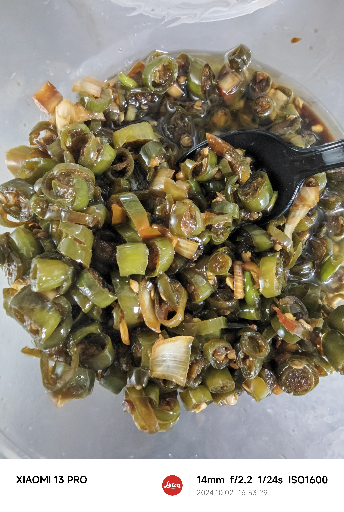

# 概述

这是一份以线椒、大葱为主料，用热油泼香调味的做法。

可用于大米、面条、肠粉、烧饼、馒头等调味料食用

# 清单

| 原料               | 计量1          | 计量2           | 计量3 |
|--------------------|----------------|-----------------|-------|
| 青色线椒           | 500克          | 1000克          |       |
| 红色线椒           | 100克          | 200克           |       |
| 大葱               | 100克          | 200克           |       |
| 鸡粉               | 7克（约2茶匙） | 14克（约4茶匙） |       |
| 珠江桥牌特级御品鲜 | 190克          | 380克           |       |
| 花生油             | 160克          | 320克           |       |

# 制作步骤

## 第一步

1. 线椒切圈
2. 大葱竖切4瓣，再横切
3. 将切好的辣椒和大葱放到一个不锈钢盆中
4. 加入鸡粉7克，御品鲜190克，并搅拌均匀

## 第二步

1. 使用炒菜锅，倒入大约160克花生油
2. 加热花生油至10层热
3. 将热油浇在辣椒上面，**快速搅拌辣椒1分钟**。

# 收尾与保存

1. **完全冷却**：做好的鲜香辣椒圈必须彻底放凉后再装瓶。热的时候装瓶会产生水汽，容易导致变质。
2. **选对容器**：用**无水无油**、干净且**可密封**的玻璃罐或陶瓷罐。保存时玻璃罐是很好的选择，前提是确保辣椒已经冷却。如果继续使用不锈钢钢盆等容器，又无法做到**密封**，建议两天内食用完。
3. **密封冷藏**：装瓶后盖紧盖子，放入冰箱冷藏保存。取用时，务必用干净且干燥的勺子或筷子，避免带入生水或细菌。
