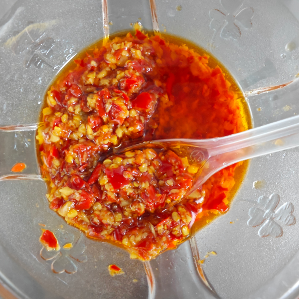

# 概述

这是一份以线椒、大蒜为主料，用热油泼香调味的做法。

可用于大米、面条、肠粉、烧饼、馒头等调味料食用

# 清单

| 原料                   | 计量1 | 计量2  | 计量3 |
|------------------------|-------|--------|-------|
| 红色线椒               | 500克 | 1000克 |       |
| 大蒜                   | 500克 | 1000克 |       |
| 大豆油（花生油成本高） | 500克 | 1000克 |       |
| 珠江桥牌金标生抽       | 200克 | 400克  |       |
| 海天米醋               | 10克  | 20克   |       |
| 鸡粉                   | 20克  | 40克   |       |
| 白糖                   | 5克   | 10克   |       |
| 盐                     | 10克  | 20克   |       |

# 制作步骤

## 第一步

1. 清洗**红色线椒**和**大蒜**
2. 倒入搅碎机（绞肉机），打成碎屑（不能太碎）
3. 倒入不锈钢盆中

## 第二步

1. 使用炒菜锅（圆底尖锅灵活方便），不要开火，先加入大豆油500克，生抽200克，米醋10克，鸡粉20克，白糖5克，盐10克。
2. 全部放完之后开火，可以全程大火。用锅铲翻一下，使调料混合均匀。
3. 等待沸腾。当出现大量气泡的时候，再等待10秒钟左右关火，立即倒入蒜蓉辣椒盆中，然后快速搅拌均匀即可。

# 收尾与保存

1. 待冷却之后，放入冰箱保存（最佳保质期7天）
